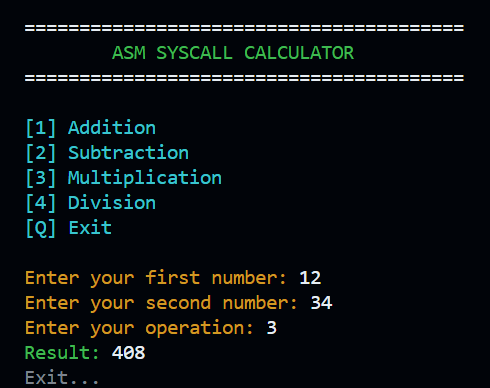

# ASM Syscall Calculator

<p align="center">


</p>

🇬🇧 English | 🇷🇺 [Русский](README_RU.md)

A simple command-line calculator written in x86-64 Assembly using raw Linux system calls (without libc).

## Features

- Integer addition
- Integer subtraction
- Integer multiplication
- Integer division
- Division-by-zero handling
- Invalid operation handling
- Manual string-to-integer conversion
- Manual integer-to-string conversion
- Raw Linux syscalls (`read`, `write`, `exit`)
- No libc dependency
- ANSI color support for UI elements
- Screen clearing on startup
- Exit on 'q' input at any prompt
- NASM syntax

## Requirements

- Linux
- NASM
- GNU LD
- GNU Make

## Build

```bash
make
```

Manual build:

```bash
nasm -f elf64 src/main.asm -o bin/obj/main.o
ld bin/obj/main.o -o bin/out/calculator
```

## Run

```bash
make run
```

or

```bash
./bin/out/calculator
```

## Example

<p align="center">
  
</p>

## Project Structure

```text
.
├── src/
│   └── main.asm
├── notes/
├── bin/
├── Makefile
├── LICENSE
└── README.md
```

## About

This is my first calculator written entirely with raw Linux system calls.

The project was created to practice x86-64 Assembly, Linux syscalls, manual input/output handling, string parsing, and integer formatting without using the C standard library.

## Roadmap

- [x] Calculator on libc (System V ABI) - 🔗 *[asm-calc-libc](https://github.com/SDobyS/asm-calc-libc)*
- [x] Calculator on raw syscalls (no libc) - 🔗 *[asm-calc-syscall](https://github.com/SDobyS/asm-calc-syscall)*
- [x] 16-bit BIOS calculator with custom bootloader - 🔗 *[asm-calc-bios](https://github.com/SDobyS/asm-calc-bios)*

## License

MIT

---

<p align="center">
  
</p>